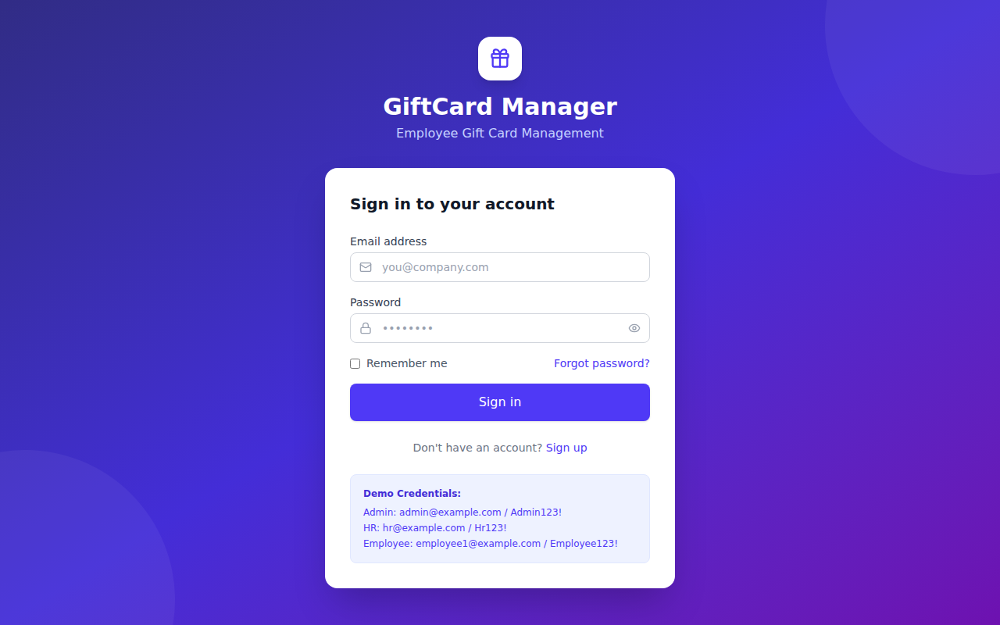
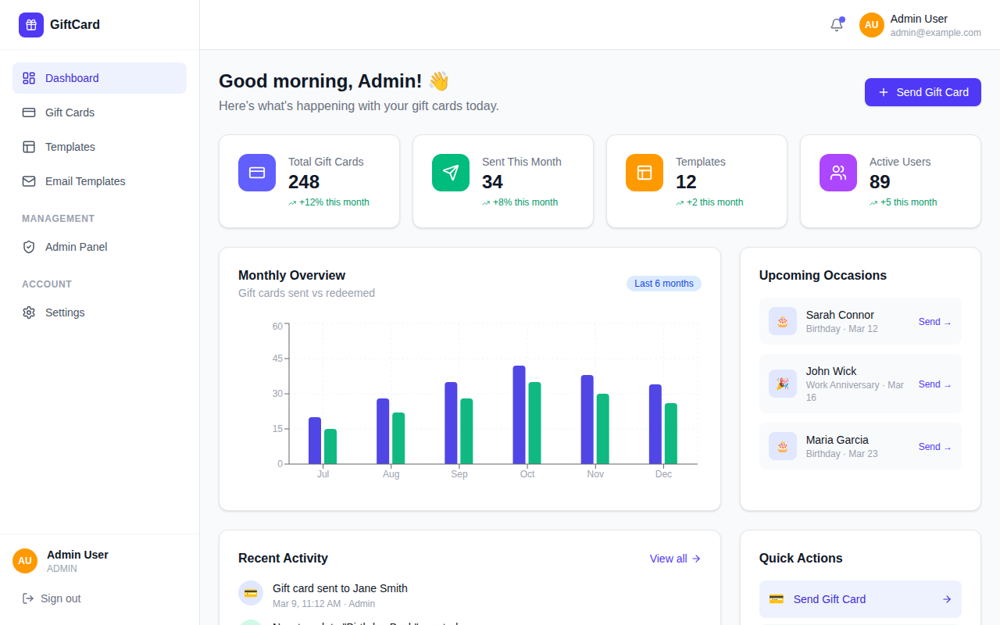
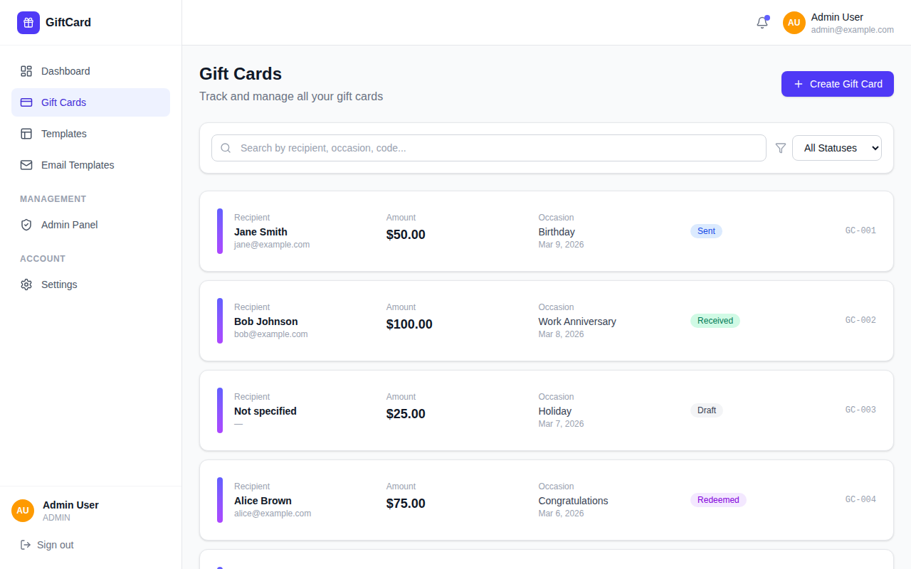
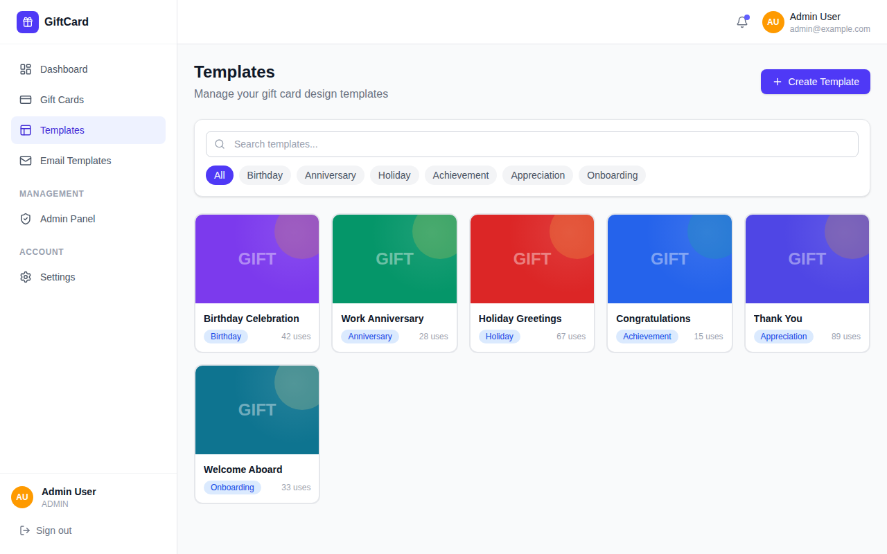
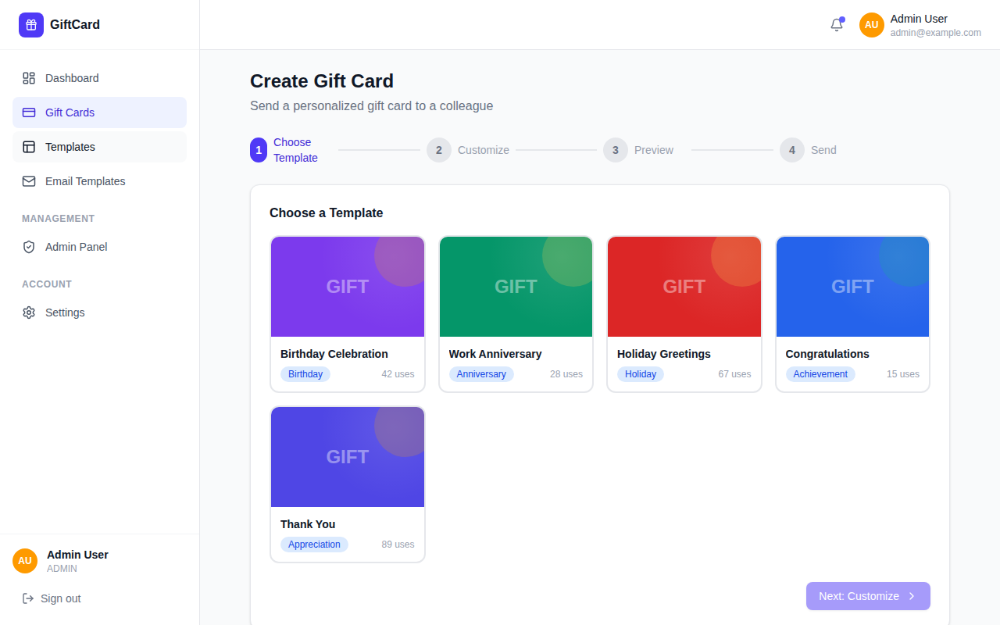
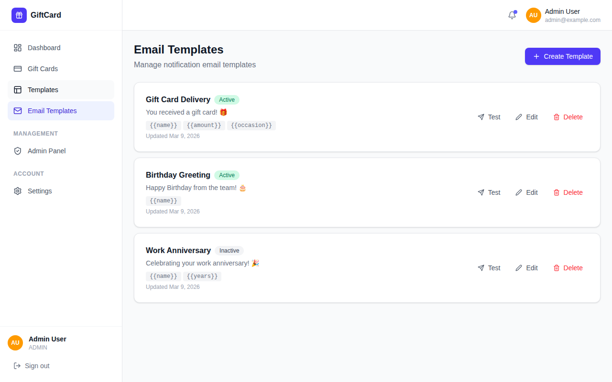
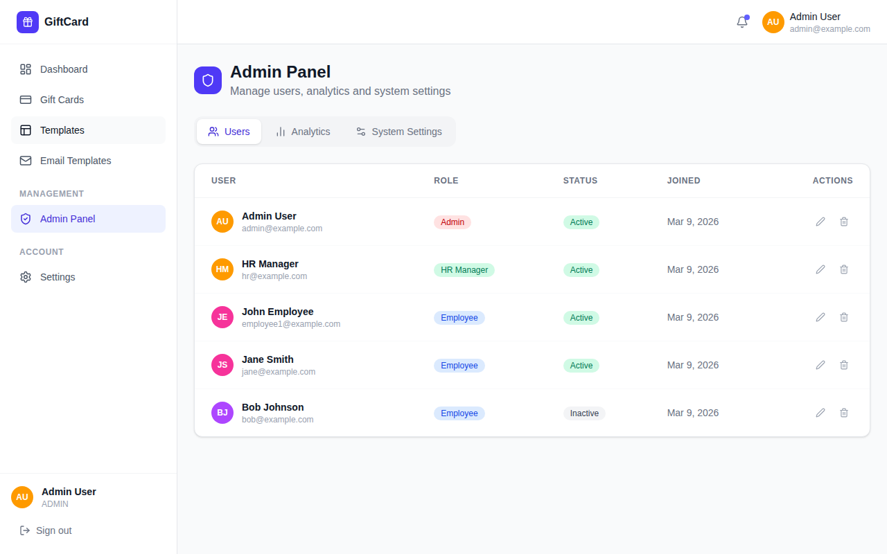
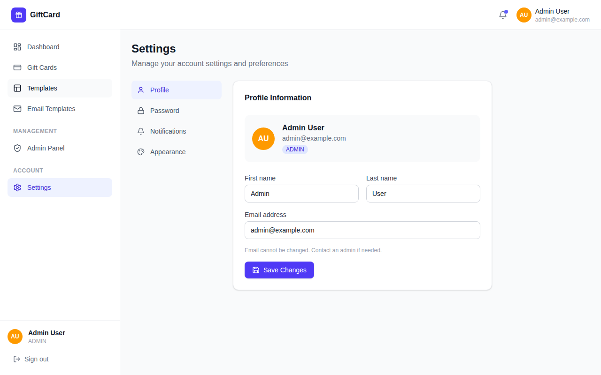

# Card Design — Employee Gift Card Management System

A full-stack web application for creating, managing, and sending employee gift cards.

- **Frontend**: React 19 + TypeScript + Vite + Tailwind CSS (runs on port **5173**)
- **Backend**: Node.js + Express + TypeScript + Prisma + SQLite (runs on port **3001**)

---

## Prerequisites (Windows)

Install the following tools before proceeding.

| Tool | Version | Download |
|------|---------|----------|
| **Node.js** (includes npm) | 18 LTS or later | <https://nodejs.org/en/download> |
| **Git** | any recent version | <https://git-scm.com/download/win> |

> **Tip**: Use the default installer options for both tools. After installing, open a new **Command Prompt** or **PowerShell** window so the changes to `PATH` take effect.

Verify the installations:

```powershell
node -v
npm -v
git --version
```

---

## 1. Clone the Repository

```powershell
git clone https://github.com/MUSTAQ-AHAMMAD/card-design.git
cd card-design
```

---

## 2. Set Up the Backend

### 2a. Install dependencies

```powershell
cd backend
npm install
```

### 2b. Configure environment variables

Copy the example environment file and open it in Notepad (or any editor):

```powershell
copy .env.example .env
notepad .env
```

Update the values as needed. The defaults work for local development:

| Variable | Default | Description |
|----------|---------|-------------|
| `DATABASE_URL` | `file:./dev.db` | SQLite database file path |
| `JWT_SECRET` | *(change this)* | Secret key for access tokens |
| `JWT_REFRESH_SECRET` | *(change this)* | Secret key for refresh tokens |
| `ACCESS_TOKEN_EXPIRY` | `15m` | Access token lifetime |
| `REFRESH_TOKEN_EXPIRY` | `7d` | Refresh token lifetime |
| `PORT` | `3001` | Port the backend listens on |
| `FRONTEND_URL` | `http://localhost:5173` | Allowed CORS origin |
| `SMTP_HOST` | `smtp.gmail.com` | SMTP server host |
| `SMTP_PORT` | `587` | SMTP server port |
| `SMTP_USER` | *(your email)* | SMTP login user |
| `SMTP_PASS` | *(your app password)* | SMTP login password |
| `SMTP_FROM` | *(sender address)* | "From" address in emails |

> **Gmail tip**: Use an [App Password](https://support.google.com/accounts/answer/185833) for `SMTP_PASS` when 2-Step Verification is enabled.

### 2c. Set up the database

```powershell
npm run prisma:generate
npm run prisma:migrate
npm run prisma:seed
```

These commands create the SQLite database, run all migrations, and seed it with initial data.

---

## 3. Set Up the Frontend

Open a **new** terminal window, then:

```powershell
cd card-design\frontend
npm install
```

---

## 4. Run the Application

You need **two terminal windows** running at the same time.

### Terminal 1 — Backend

```powershell
cd card-design\backend
npm run dev
```

You should see output similar to:

```
Server running on port 3001
```

### Terminal 2 — Frontend

```powershell
cd card-design\frontend
npm run dev
```

You should see output similar to:

```
  VITE v7.x.x  ready in xxx ms

  ➜  Local:   http://localhost:5173/
```

Open your browser and navigate to **<http://localhost:5173>** to use the application.

---

## 5. Build for Production (Optional)

### Backend

```powershell
cd backend
npm run build
npm start
```

### Frontend

```powershell
cd frontend
npm run build
```

The compiled frontend files will be in `frontend/dist/`.

---

## Screenshots

### Login


### Dashboard


### Gift Cards


### Templates


### Create Gift Card


### Email Templates


### Admin Panel


### Settings


---

## Troubleshooting

| Problem | Solution |
|---------|----------|
| `node` or `npm` not recognised | Close and reopen the terminal after installing Node.js, or add it to `PATH` manually |
| Port 3001 / 5173 already in use | Change `PORT` in `backend/.env`, or stop the other process using that port |
| Prisma migration errors | Delete `backend/prisma/dev.db` and re-run `npm run prisma:migrate` |
| SMTP / email errors | Double-check `SMTP_USER` and `SMTP_PASS`; use a Gmail App Password if 2FA is enabled |